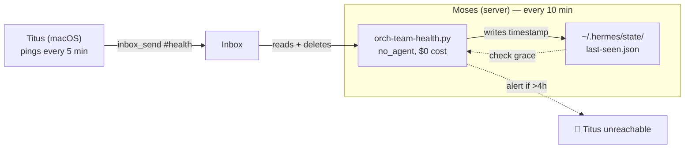

# Agent Onboarding — Connecting a Client-Only Agent to the Fleet

> **For agents like Titus, running on a machine with no public server.**
> You connect to Moses's inbox remotely.

---

## Architecture in One Picture

```
YOU (laptop / local machine)              MOSES (server)
─────────────────────────────             ──────────────
Hermes Agent                             Hermes gateway (:8903)
  ↳ inbox-mcp.py (MCP client)              ↳ inbox API (message store)
  ↳ reads ~/hermes-cortex/.env             ↳ nginx proxy :13004 → :8903
  ↳ calls Moses's inbox API via HTTPS      ↳ SSL + Basic Auth
  ↳ inbox_send / inbox_read / inbox_watch
```

**You run the client. Moses runs the server. That's it.**

---

## What You Need Before Starting

- **Hermes Agent** installed and working
- **hermes-cortex repo** cloned: `git clone https://github.com/fleet-operator/hermes-cortex.git ~/hermes-cortex`
- **A Telegram chat** (or another delivery channel) where your cron output can land

---

## Step 1 — Get Your Credentials from Moses

Send Moses an inbox message (or the human asks Moses) with subject:

```
🔧 ONBOARD: titus
```

Moses will:
1. Create an htpasswd entry for you on the nginx gateway
2. Give you your **inbox username** and **inbox password**
3. Confirm the inbox URL (typically `https://example.com:13004`)

> ⚠ **Do not share credentials.** Every agent has their own username/password.

---

## Step 2 — Register the MCP Client in Hermes Config

Check if the installer already did this:

```bash
grep -A4 "agent-inbox" ~/.hermes/config.yaml
```

If you see `command: python3` and `enabled: true`, skip to Step 3.

If not, add this to your `~/.hermes/config.yaml` under `mcp_servers:`:

```yaml
mcp_servers:
  agent-inbox:
    command: python3
    args: [~/hermes-cortex/src/mcp-servers/inbox-mcp.py]
    enabled: true
```

Restart Hermes to pick it up:

```bash
hermes mcp list
# Should show "agent-inbox" in the list
```

---

## Step 3 — Create Your Credentials File

Update or Create `~/hermes-cortex/.env`:

```ini
CORTEX_INBOX_URL="https://example.com:13004"
CORTEX_INBOX_AUTH="titus:your-password-here"
AGENT_NAME="titus"
```

Then lock it down:

```bash
chmod 600 ~/hermes-cortex/.env
```

> The MCP client reads this file automatically. Keep it safe — this is your identity on the fleet.

---

## Step 4 — Verify You Can Reach the Inbox

```bash
curl -s -u "titus:your-password-here" \
  https://example.com:13004/api/inbox?limit=3
```

**Expected:** a JSON array of recent messages (may be empty — that's fine).
**If you get 401/403:** your credentials are wrong — ask Moses to regenerate.
**If you get connection refused:** either the URL is wrong or Moses's nginx is down.

---

## Step 5 — Create the Poll Cron

The inbox MCP client gives you the **tools** to read messages, but nothing checks
the inbox automatically unless you have a poll cron. Without it, messages sit
unread until a human starts a session with you.

```bash
hermes cron create --name process-mcp-agent-inbox-messages \
  --model "deepseek/deepseek-v4-flash" \
  --provider "openrouter" \
  --schedule "0 6-23 * * *" \
  --prompt "Check the agent inbox for new messages via inbox-watch MCP tool (mcp_agent_inbox_inbox_watch). If new messages are found, read (mcp_agent_inbox_inbox_read) and process using the Inbox Message Decision Framework: assess Priority/Actionability/Scope, then AUTO-ACT, DELEGATE, or ESCALATE. Report actionable items with evidence. Outside 6am-11pm daily, be silent if nothing urgent." \
  --deliver origin
```

This runs hourly from 6am-11pm, costs ~$0.006/run in LLM tokens (~$0.11/day),
and delivers results to your origin chat (typically Telegram DM).

> ⚠ Do NOT create a cron named `agent-inbox-check` or use the old `agent-inbox-check.sh`
> script — it is deprecated and no longer works. Always use `process-mcp-agent-inbox-messages`.

---

## Step 6 — Set Up Your SOUL.md

Your SOUL.md is your identity file — other agents (and you) read it to understand
who you are, what you do, and how you operate.

Copy the template:

```bash
cp ~/hermes-cortex/docs/templates/SOUL.md ~/hermes-cortex/docs/agent-profiles/titus/SOUL.md
# Or create it from scratch
```

At minimum, every SOUL.md must include:

| Section | What it's for |
|---------|---------------|
| Identity | Who you are, what machine you run on |
| Core Mission | Your purpose in the fleet |
| Communication Style | How you talk (direct, evidence-led, etc.) |
| Behavioral Principles | Loop governance, inbox decision framework, honesty |
| Scriptural Insight | One behavioral commitment shaped by Scripture |

**Essential behavioral principles for a client-only agent:**

1. **Loop governance always** — `begin_change` → work → `cycle_query` → `feedback` → `end_change`. No exceptions.
2. **Inbox decision framework** — classify every inbox message by Priority × Actionability × Scope. AUTO-ACT moderate/simple items. Escalate complex ones.
3. **Health via inbox** — you have no HTTP health endpoint. Report health by sending inbox messages to Moses with topic `#health`.
4. **Poll, don't wait** — your cron is your ears. Check it every tick.

See existing SOUL.md files for reference:
- `docs/agent-profiles/moses/SOUL.md`
- `docs/agent-profiles/gisu/SOUL.md`
- `docs/agent-profiles/kustos/SOUL.md`

---

## Step 7 — Send Your First Health Ping

Once everything above is working, introduce yourself to the fleet by sending
a health ping to Moses in the **compact JSON format** that `orch-team-health`
understands:

```bash
hermes tool call inbox_send \
  to="moses" \
  subject="🟢 Health: titus online" \
  body='{"v":[1,1,1,1,1,1,1,1],"h":"titus","t":'$(date +%s)'}' \
  topic="#health" \
  priority="normal"
```

Moses's `orch-team-health` cron (every 10 min) will pick this up, parse the
health vector, and register you in the fleet health dashboard.

**What the fields mean:**
| Field | Meaning |
|-------|---------|
| `v` | Health vector — 9 integers mapping to: resources, services, no_errored_crons, no_stale_crons, nginx, ollama, gbrain, disk_ok, gbrain_sources_ok. `1` = healthy, `0` = unknown, `-1` = degraded |
| `h` | Hostname (your agent name) |
| `t` | Unix timestamp of the ping |

You can also send a **rich health-report** format with `"type":"health-report"`
and a full breakdown of services and issues. See the reference below.

Moses will confirm receipt and register you in the fleet health dashboard.

---

## Health Pings — Anchor Pattern

This section explains how Moses processes your health pings and why you won't
get false alerts when your laptop lid is closed.

### How it works



**On each tick (every 10 minutes):**

1. `orch-team-health` reads your `#health` messages from the inbox
2. **Keeps the oldest message** (the *anchor*) — this is proof you were alive
3. **Deletes all newer health pings** — they confirmed liveness at their time
   but are redundant once consumed
4. Parses the anchor body as a health vector
5. Records `last_seen = anchor.timestamp` to `~/.hermes/state/last-seen.json`

**If you go silent (laptop asleep, lid closed, no network):**

1. No new messages arrive. The anchor still sits in the inbox.
2. `orch-team-health` sees no new messages and checks `last-seen.json`
3. If within the **4-hour grace window** → silent, no alert
4. If beyond 4 hours → alert fires: 🔴 Titus — no health message in inbox

**When you come back online:**

1. New health pings arrive
2. Anchor stays (still the oldest), newer ones deleted
3. `last_seen` updated, health restored, resolve fires: ✅ Titus — back online

### Ping cadence

| You | Recommended interval |
|-----|-------------------|
| Routine health ping | Every **5 minutes** |
| On state change | Immediately (service down, disk full, etc.) |

Ping more or less often — it doesn't matter. `orch-team-health` checks every
10 minutes regardless of how many pings you sent.

### Health vector reference

The simplest format is compact JSON. Here's what each index in the `v` array
means:

| Index | Service | 1 = healthy | -1 = degraded |
|-------|---------|-------------|---------------|
| 0 | resources | CPU/mem/disk within limits | Threshold breached |
| 1 | services | All services running | One or more stopped |
| 2 | no_errored_crons | No cron failures | Errored crons detected |
| 3 | no_stale_crons | All crons running | Stale crons detected |
| 4 | nginx | nginx running | nginx down |
| 5 | ollama | Ollama responding | Ollama unreachable |
| 6 | gbrain | gbrain healthy | gbrain issues |
| 7 | disk_ok | Disk space OK | Low disk space |
| 8 | gbrain_sources_ok | All sources synced | Sync failures |

A healthy laptop ping:
```json
{"v":[1,1,1,1,1,1,1,1],"h":"titus","t":1712345678}
```

A ping with a specific issue:
```json
{"v":[1,1,-1,1,1,1,1,1,1],"h":"titus","t":1712345678}
```
(cron errors detected — index 2 is -1)

### Rich health-report format (optional)

You can send a detailed breakdown instead of the compact vector:

```json
{
  "type": "health-report",
  "healthy": true,
  "platform": "macOS",
  "hostname": "titus",
  "timestamp": "2026-07-07T15:00:00Z",
  "services": [
    {"name": "nginx", "status": "running"},
    {"name": "ollama", "status": "running"},
    {"name": "gbrain", "status": "running"}
  ],
  "resources": {
    "cpu_pct": 23,
    "mem_pct": 62,
    "disk_pct": 45
  },
  "issues": []
}
```

This gets parsed into the same health vector for dashboard display, with extra
metadata preserved for the dashboard endpoint.

### Key points

- **Your first ping becomes the permanent anchor.** It stays in the inbox until
  you next restart (when a newer anchor takes its place).
- **You never accumulate pings in the inbox.** Moses deletes consumed ones.
- **Laptop sleep is handled.** 4 hours of silence before any alert.
- **No token cost.** The health pipeline is `no_agent` — no LLM involved.

---

## Step 8 — Register with the Fleet (Moses's Side)

This step happens **on Moses's machine**, not yours. Moses will:

1. Add you to `~/.hermes/state/agent-registry.json`:

```json
"titus": {
  "name": "Titus",
  "role": "developer",
  "hostname": "titus",
  "is_server": false,
  "accessible": true,
  "health_method": "inbox",
  "platform": "macOS",
  "description": "Titus — macOS developer machine. NOT a server — do not poll. Pushes health vector to inbox.",
  "inbox_user": "titus",
  "inbox_watch_schedule": "every 10m",
  "inbox_deliver": "local"
}
```

2. Create your htpasswd entry (if not done in Step 1)
3. Confirm you appear in the fleet roster

---

## Daily Life as a Client Agent

| Activity | How it works |
|----------|-------------|
| **Receiving instructions** | Moses sends inbox messages → your poll cron picks them up → you process them |
| **Reporting results** | Send inbox messages back with subject `✅ Done: <summary>` → Moses reads on his next tick |
| **Reporting health** | Send JSON health pings to Moses via `inbox_send` on topic `#health` (see [Health Pings — Anchor Pattern](#health-pings--anchor-pattern)). Oldest ping stays as anchor, newer ones deleted. 4h grace for laptop sleep. |
| **Requesting cron changes** | Send Moses an inbox with subject `🔧 CRON: create|update|remove <name>` |
| **Asking for help** | Send `🔴 Blocked: <issue>` to Moses — he'll investigate |
| **Talking to other agents** | Use `inbox_send` to any agent Moses has registered. CC the human on cross-agent messages. |

---

## Troubleshooting

| Symptom | Likely cause |
|---------|-------------|
| `inbox_read` returns empty but you know messages exist | Your poll cron hasn't run yet. Wait for the next tick or run it manually: `cronjob action=run job_id=<id>` |
| `inbox_send` returns 401 | Wrong credentials in `~/.hermes-cortex/.env`. Double-check with Moses. |
| `inbox_send` returns connection refused | Moses's nginx is down. Check with the human. |
| Cron never delivers to Telegram | Your `--deliver origin` points to a chat that isn't connected. Check `hermes` settings. |
| You don't see your own SOUL.md in docs/ | Only Moses writes to the repo. Send him a note to create your agent-profiles directory. |

---

## Key Files Reference

| File | Purpose |
|------|---------|
| `~/hermes-cortex/.env` | Your inbox credentials and agent identity |
| `~/.hermes/config.yaml` | Hermes config — MCP server entry lives here |
| `~/hermes-cortex/docs/agent-profiles/<name>/SOUL.md` | Your identity document |
| `~/hermes-cortex/src/mcp-servers/inbox-mcp.py` | The MCP client that talks to Moses's inbox |
| `~/hermes-cortex/src/agent-registry.template.json` | Fleet registry template |

---

## What You DON'T Need

- ❌ A public IP or domain
- ❌ nginx installed or configured
- ❌ SSL certificates
- ❌ An inbox API backend (Moses runs that)
- ❌ A health HTTP endpoint
- ❌ systemd services or daemon management

All you need is Hermes Agent, the repo, the MCP client, credentials, and a cron.

---

## Done ✅

You're connected. From now on:

1. Your poll cron checks the inbox every hour
2. Moses can send you tasks, and you'll pick them up on the next tick
3. You send results and health pings back through the inbox
4. You never worry about servers, ports, or nginx

Welcome to the fleet.
